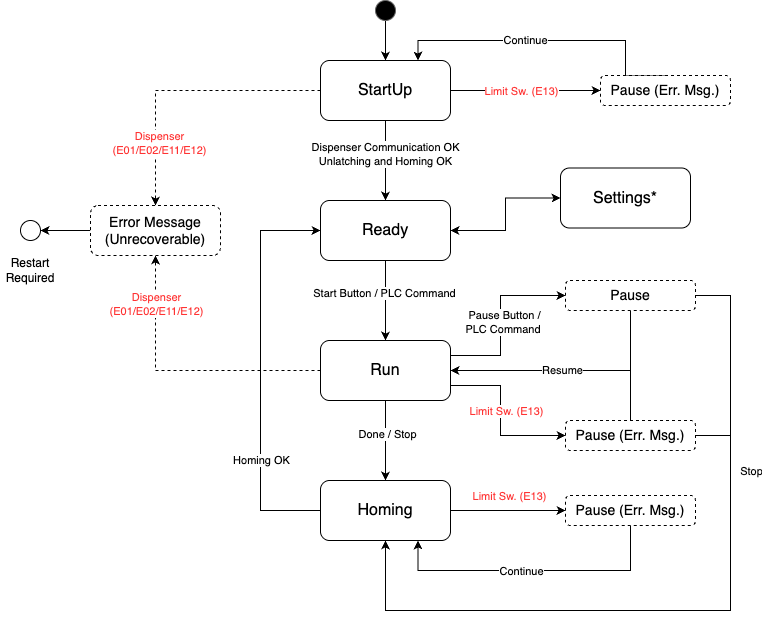
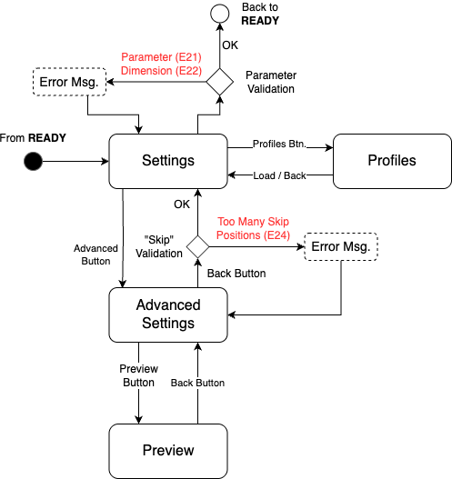

# System States

This document provides visual references for the different states of the system. Most states represent a single `Controller`, which handle the system's logic and state. For simplicity, the "Settings" state diagram is separated from the main state diagram.

## Main States

\newpage

## Settings States

\newpage
